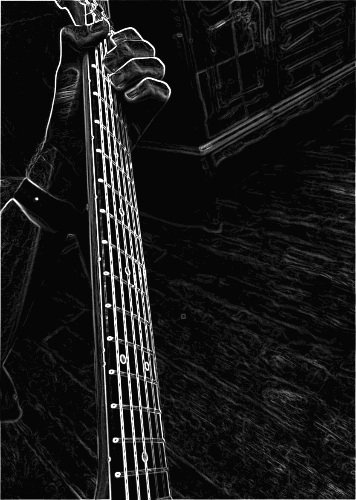
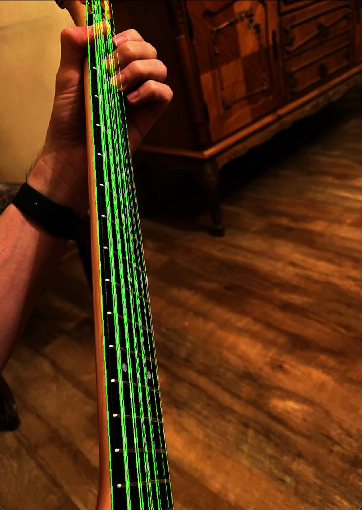

# HoughTransform

A real-time line detection app for iOS, macOS, and visionOS using the Hough Transform algorithm with GPU-accelerated Metal shaders.

## Features

- **Real-time line detection** from camera or photo library
- **GPU-accelerated processing** using Metal compute shaders
- **Multi-stage visualization** - view any step of the processing pipeline:
  - Input → Downsampled → Grayscale → Blurred → Edges → Hough Accumulator
- **Two edge detection algorithms**: Sobel and Canny
- **Interactive parameter controls** with immediate visual feedback


The app displays detected lines overlaid on your chosen visualization stage. Use the segmented control to switch between processing stages and see how the algorithm works step-by-step.

## How It Works

The Hough Transform converts edge pixels into a parameter space (rho, theta) where lines appear as peaks. The processing pipeline:

1. **Downsample** - Reduce resolution for performance (1x, 2x, 4x, 8x)
2. **Grayscale** - Convert to luminance
3. **Gaussian Blur** - Reduce noise (configurable kernel size and sigma)
4. **Edge Detection** - Find gradients using Sobel or Canny
5. **Hough Transform** - Compute accumulator space with optimized LUT
6. **Line Detection** - Extract lines from accumulator peaks

### Sobel Operator for edge detection


### Hough Transform for detecting lines as math functions from given image or video stream


## Parameters

| Parameter             | Description                            |
| --------------------- | -------------------------------------- |
| Blur Kernel           | Gaussian kernel size (3-9)             |
| Blur Sigma            | Gaussian blur intensity                |
| Edge Algorithm        | Sobel or Canny                         |
| Edge Thresholds       | Low/high thresholds for edge detection |
| Rho Resolution        | Distance resolution in pixels          |
| Theta Resolution      | Angle resolution in degrees            |
| Accumulator Threshold | Minimum votes for line detection       |
| Max Lines             | Maximum number of lines to detect      |

## Requirements
- Device with Metal support
- Camera access (for live detection)

## Installation

1. Clone the repository
2. Open `HoughTransform.xcodeproj` in Xcode
3. Build and run on your device or simulator

## Architecture

```
HoughTransform/
├── Models/              # Data models (HoughParameters, InputSource)
├── Views/               # SwiftUI views
├── Metal/
│   ├── Pipelines/       # Processing pipeline coordination
│   └── Shaders/         # Metal shader wrappers
├── metal/               # .metal shader source files
├── SourceProviders/     # Camera and texture input handling
└── DI/                  # Dependency injection (Factory)
```

**Key Technologies:**
- SwiftUI + Metal + AVFoundation
- Factory for dependency injection
- Observable for reactive state management

## License

MIT License
